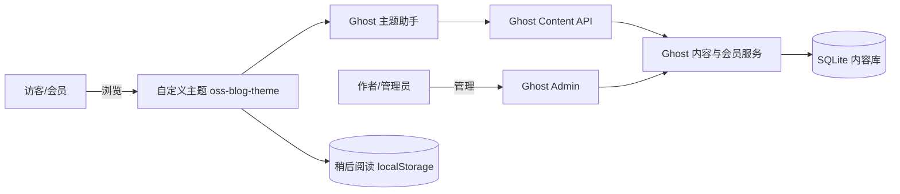

# OSS Blog —— 开源个人博客系统二次开发

> 基于开源博客平台 [Ghost](https://github.com/TryGhost/Ghost)（v6.59.0）二次开发的个人博客系统。保留 Ghost 原生的认证、编辑器、标签、会员与评论能力，通过自定义主题 `oss-blog-theme` 完成可见的二次开发，并新增「稍后阅读（收藏）」自主功能。

## 1. 项目简介

- **目标用户**：个人博客作者（管理员）与读者（访客/会员）。
- **问题场景**：需要一个"开箱即用、可注册、可写作、可评论、可搜索"的博客，同时在不重写底层能力的前提下，体验对成熟开源项目的主题扩展与局部改造。
- **功能清单**：
  - 访客：浏览文章、按标签筛选、站内全文搜索。
  - 会员：注册/登录、评论。
  - 管理员：发布/编辑文章、管理标签与会员、设置评论与搜索权限。
  - 自定义主题 `oss-blog-theme`（基于官方 `Source` 主题二次开发）。
  - 自主功能：**稍后阅读（收藏）**，纯前端 `localStorage` 实现，无需后端密钥。

## 2. 技术栈与系统架构

- 后端：Ghost 6.59.0（Node.js 22 LTS / JavaScript / Handlebars / SQLite）
- 前端主题：Handlebars + CSS + 原生 JS（无框架）
- 命令行：Ghost CLI 1.32.3



### 修改边界

- **允许修改**：`theme/`（主题源码）、`tests/`、`docs/`、根目录文档与脚本。
- **禁止修改 / 提交**：`runtime/`（Ghost 运行目录，含数据库、日志、密钥，见 `.gitignore`）。

## 3. 环境要求与版本检查

| 依赖 | 版本 | 检查命令 |
| --- | --- | --- |
| Node.js | 22 LTS | `node -v` |
| Ghost CLI | 1.32.3 | `ghost --version` |
| pnpm | 10+ | `pnpm -v` |

## 4. 安装、配置与运行

### 4.1 安装 Ghost 本地基线（已固定版本 6.59.0）

```bash
mkdir oss-blog
cd oss-blog
mkdir runtime
cd runtime
ghost install local
```

安装完成后首次访问 `http://localhost:2368/ghost/` 完成管理员初始化。

### 4.2 启动 / 停止

```bash
cd runtime
ghost start      # 启动
ghost stop       # 停止
ghost ls         # 查看运行状态
ghost doctor     # 环境自检
ghost log        # 查看日志
```

- 前台地址：`http://localhost:2368/`
- 管理端地址：`http://localhost:2368/ghost/`

### 4.3 安装自定义主题

1. 进入主题源码目录构建并打包：

   ```bash
   cd theme/oss-blog-theme
   pnpm install
   pnpm build          # 编译 CSS/JS
   pnpm zip            # 生成 dist/oss-blog-theme.zip
   ```

2. 在 Ghost 管理端 **Settings → Design → 上传主题**，上传 `theme/oss-blog-theme/dist/oss-blog-theme.zip` 并点击 **激活**。

3. 主题回滚：管理端 Design 页面可切换回内置主题（Source / Casper）。

### 4.4 数据导出与恢复

- 导出：管理端 **Settings → Labs → 导出所有内容**，得到 JSON 文件。
- 恢复：新建空白 Ghost 实例后，在同一页面导入该 JSON 文件，重启后文章、标签、会员、评论均会恢复。

## 5. 最小演示数据与 Demo 流程

- 演示数据：至少 8 篇文章、3 个标签、2 个会员账号（1 管理员 + 1 会员）。
- 演示脚本：
  1. 用会员账号登录，搜索一篇含指定中文关键词的文章。
  2. 切换管理员发布一篇带标签的新文章，回到前台验证可见。
  3. 会员发表评论，展示评论权限与错误状态。
  4. 点击文章卡片或详情页的书签按钮收藏，再点击导航栏「稍后阅读」查看收藏列表。
  5. 展示 `git log` 的 PR / Commit 证据与内容导出位置。

## 6. 测试

见 [tests/acceptance.md](tests/acceptance.md)，覆盖功能、权限、界面（桌面/窄屏/键盘）、恢复四类测试。

主题兼容性校验：

```bash
cd theme/oss-blog-theme
pnpm exec gscan .   # 输出 "Your theme is compatible with Ghost 6.x"
```

## 7. 二次开发内容（与上游基线差异）

| 模块 | 上游基线 | 本次改动 |
| --- | --- | --- |
| 主题 | 官方 `Source` v1.7.2 | Fork 为 `oss-blog-theme` v1.0.0-lab |
| 导航 | 仅搜索入口 | 新增「稍后阅读」入口 + 收藏计数 badge |
| 文章卡片 | 无收藏 | 卡片右上角新增收藏按钮 |
| 文章详情 | 标题/正文 | 标题下新增收藏按钮 |
| 自主功能 | 无 | 「稍后阅读」抽屉面板 + `localStorage` 收藏（空状态/移除/清空） |

关键文件：`theme/oss-blog-theme/assets/js/bookmarks.js`、`theme/oss-blog-theme/partials/bookmarks-drawer.hbs`、`theme/oss-blog-theme/partials/icons/bookmark.hbs`。

## 8. 上游项目、第三方资源来源与 License

- 上游项目：https://github.com/TryGhost/Ghost （MIT）
- 主题基线：https://github.com/TryGhost/Source （MIT）
- 完整归因见 [NOTICE.md](NOTICE.md)。

## 9. 安全注意事项

- `runtime/` 下的数据库、日志、密钥、上传图片均已通过 `.gitignore` 排除，不提交到 Git。
- 演示账号密码、Ghost Content API Key 等敏感信息不得写入仓库或文档。
- 「稍后阅读」数据仅保存在浏览器 `localStorage`，不涉及服务端与个人隐私数据。

## 10. 个人开发记录

- 仓库地址：https://github.com/rei-poca/ghost-blog
- 分支与提交：`feature/blog-enhancement` → Pull Request → `main`，标签 `v1.0-lab`。
- 查看：`git log --oneline --graph --decorate --all -n 30`
