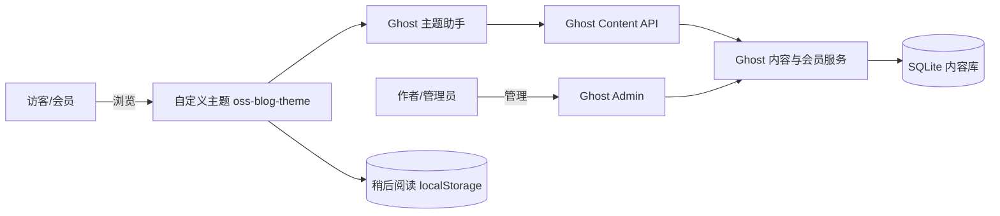

# 项目总体架构

## 一、总体架构（Ghost 路线）

架构说明：Ghost 核心负责认证、内容、标签、会员和评论；学生不重写这些基础能力。自定义主题和「稍后阅读」扩展模块是主要修改边界。

## 二、关键目录说明（5 个）

| 目录 | 作用 |
| --- | --- |
| `runtime/` | Ghost 运行目录（ghost-cli 安装生成），内含版本代码与内容数据 |
| `runtime/current/` | 当前活动版本，Junction 指向 `versions/6.59.0/` |
| `runtime/content/data/` | SQLite 数据库与内容文件（文章/会员/评论落库处） |
| `theme/oss-blog-theme/` | 自定义主题源码（本实验主要改动边界） |
| `runtime/current/core/` | Ghost 内核（server/models/services/web 等，只读参考） |

## 三、请求路径（从主题到数据库）

1. 访客/会员请求前台页面。
2. Ghost 路由选择主题中的 Handlebars 模板（`default.hbs` → `index.hbs`/`post.hbs`/`tag.hbs` 等）。
3. 模板通过 Ghost 主题助手（`{{#get}}`、`{{#foreach}}`、`{{ghost_head}}` 等）或 Content API 读取内容。
4. 内容服务访问 SQLite（`runtime/content/data/`）返回文章、标签、会员、评论数据。
5. 渲染后的 HTML 返回浏览器；「稍后阅读」数据则仅存于浏览器 `localStorage`，不经服务端。

## 四、允许修改 / 禁止修改目录

- **允许修改**：`theme/`（主题源码）、`tests/`、`docs/`、根目录文档与脚本。
- **禁止修改 / 提交**：`runtime/`（Ghost 运行目录，含数据库 `content/data/`、日志、密钥、上传图片）。已在 `.gitignore` 中排除。
